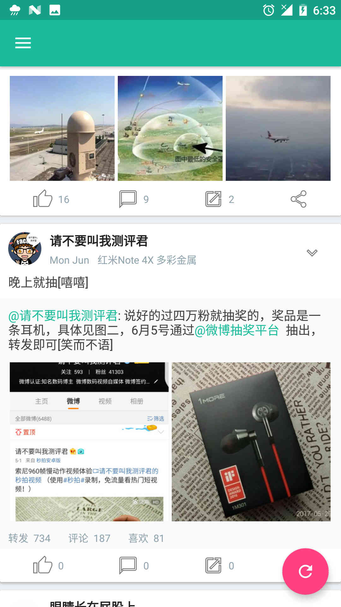
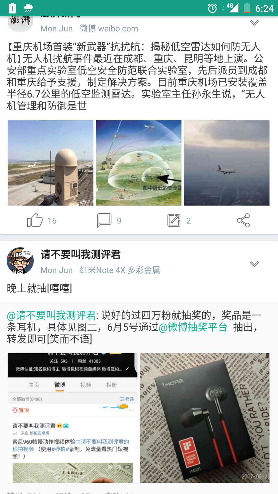
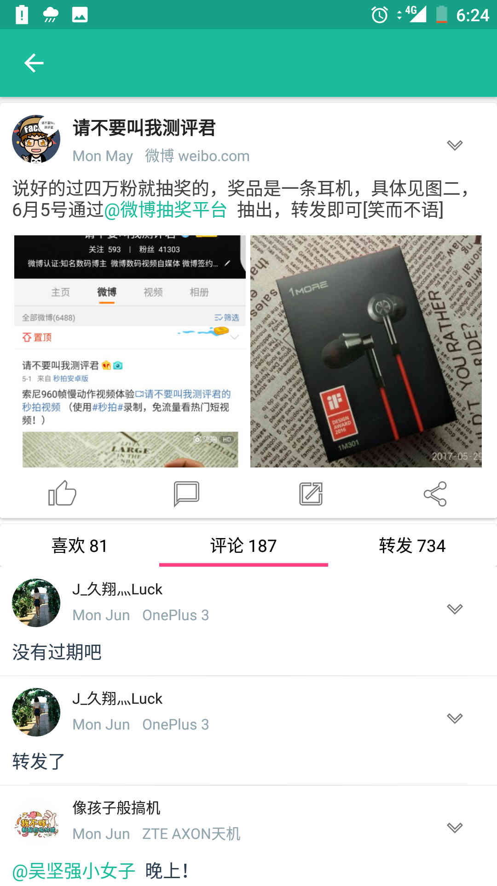
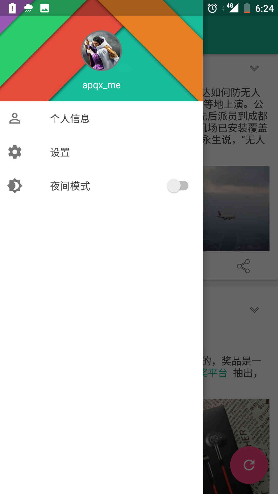
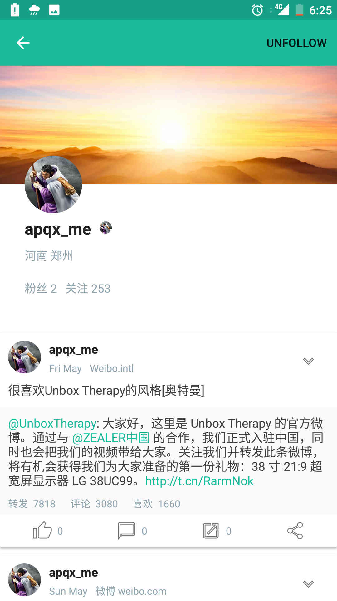
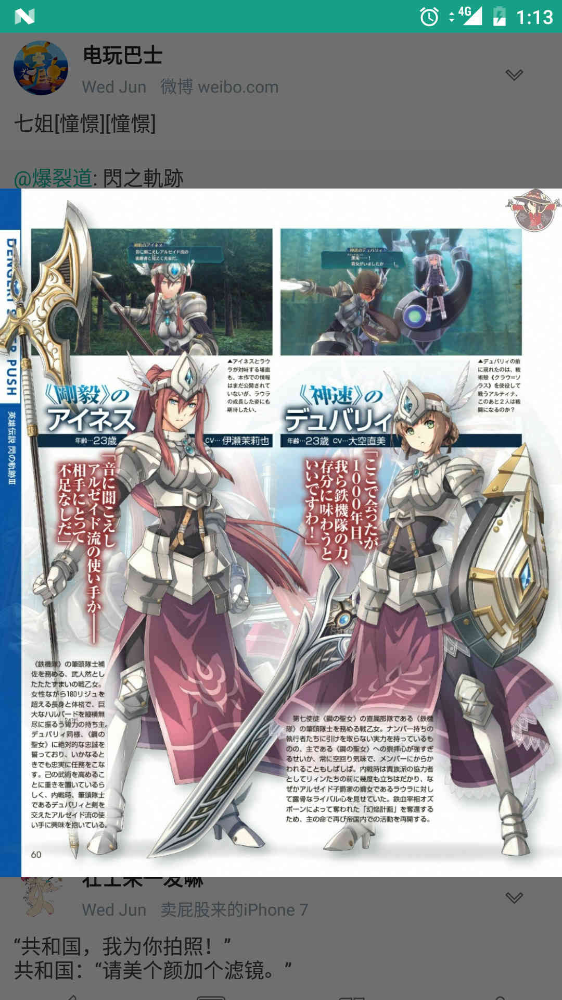
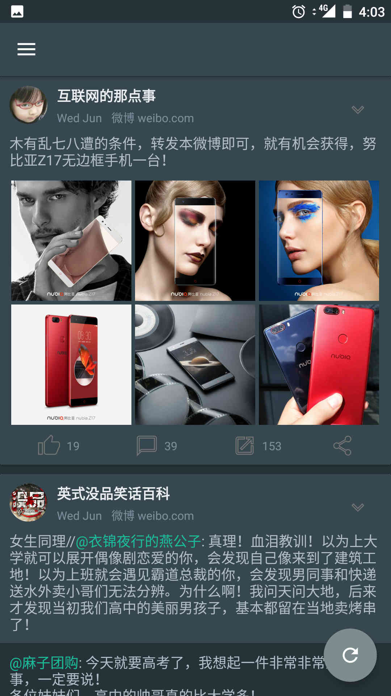
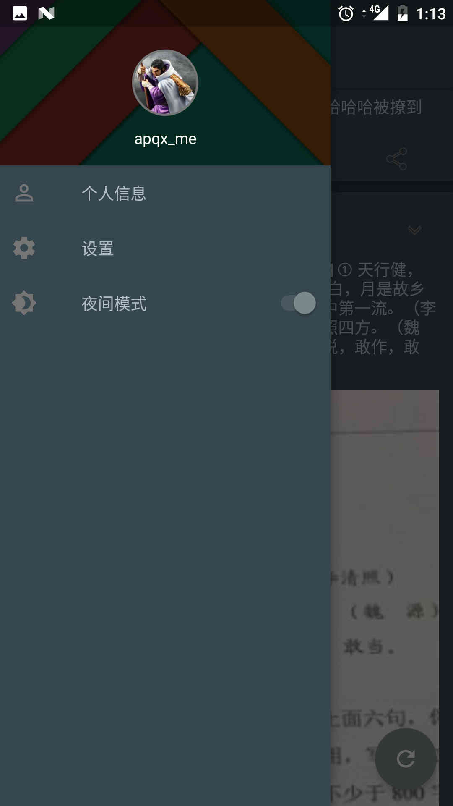
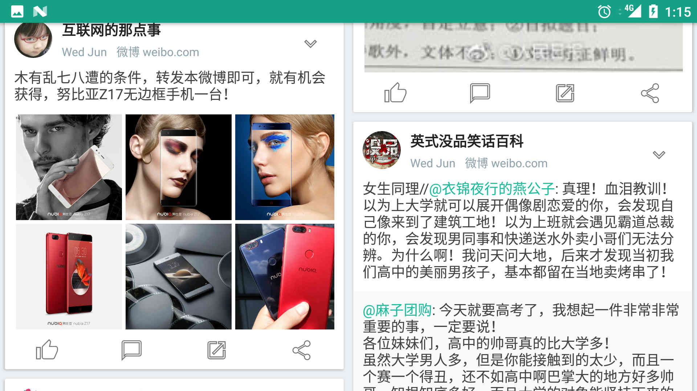
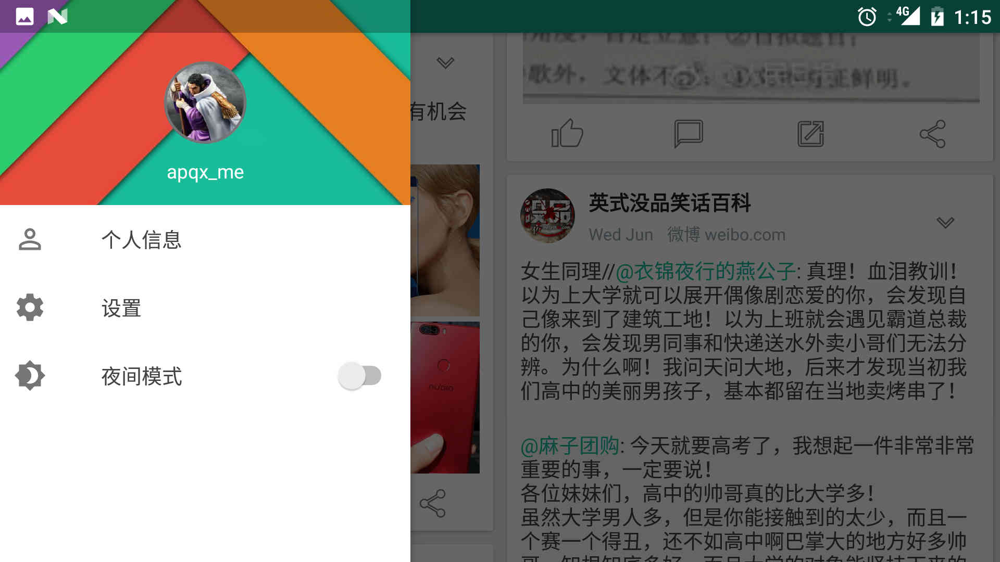

# 一次独立APP的尝试

## APQX

## 2017年6月1日

这个是我尝试做的第一款比较完整的软件，不喜欢新浪微博官方软件的广告骚扰和后台重启，不如为自己写一个轻量级的微博客户端，实现微博的功能而做到“召之即来，挥之即去”的用户体验，由于涉及到OAuth认证和从网络加载媒体资源，我第一次遇到了一些之前没想到的问题，也第一次经历了重构，挺有意思的一个项目。

|  |  |  |  |
| :----------------------------------: | :----------------------------------: | :----------------------------------: | :----------------------------------: |
|  |  |  |  |

|  |  |
| :----------------------------------: | :----------------------------------: |

### OAuth2授权

因为安全性的需要，平台不可能把用户名和密码交给第三方客户端，第三方客户端也不可能在每次请求数据的时候都要求用户重新登陆授权，这正是OAuth2要解决的问题。在OAuth2协议中，客户端不持有用户名和密码，而是保存一个代表用户身份的accessToken，每次请求信息都以此来验证身份。微博使用OAuth2方式来授权客户端访问用户信息，简单来说，客户端的WebView访问微博授权网址并提交微博给第三方客户端的授权信息，用户在此网页中输入账号、密码来验证身份，然后微博服务器会返回一个授权码，客户端再用此授权码换取access_token，一旦换取成功，客户端就可以在没有用户账号和密码的情况下只使用此access_token来访问用户的微博信息。

### HTTP

常见的超文本传输协议，微博提供的接口都是GET或POST方法，比较简单，我在初期使用HttpUrlConnection和线程池来构建自己的网络访问框架，实现的很简单，即是对外提供接口，将任务放到线程池中执行，执行完成后回调，也可以结合Handler实现在UI线程中回调。对于JSON数据的解析，我使用了原始的JSONObject和JSONArray，将获取的微博数据解析为WeiboItemData对象，加载到RecyclerView中显示，同时在本地以JSON的形式保存所有的微博数据，实现离线访问。

### 图片异步加载

图片的异步加载实际上是两个问题，UI线程中更新UI和RecyclerView的子View重用问题。前者很好解决，Handler和AsyncTask等很多方式都可以实现，后者的问题表现为图片错位，即设置的图片和实际显示的图片不一致。其原因就是RecyclerView复用子View，因为图片在子线程中的下载需要时间，当下载完成后，原View很可能已经滚出屏幕，并被当作下一个ItemView进行显示，同一个View，位置却变了，自然会出现图片错位。解决方法就是在onBindViewHolder中为ItemView设置Tag，在图片下载完成后取出ItemView的Tag，判断和建立下载任务时是否一致，不一致即说明ItemView被复用了，就没有必要再为它加载这个图片了。

在开发的初期，我尝试写了自己的ImageLoader，使用LruCache和DiskLruCache为图片建立两级缓存，封装了异步加载功能。只是后来遇到的图片问题越来越多，比如GIF动图，全部自己解决太费时间，最终还是选择了Fresco，使用方便，功能强大。

### Activity滑动退出

这个问题的本质是如何控制当前Activity的整个View进行滑动，并在结束滑动时退出Activity。其实思路也很简单，DecorView是整个View树的根节点，它之下有一个竖直方向的LinearLayout，包含TitleView和ContentView，我要做的就是将一个ViewGroup插入到DecorView和LinearLayout之间，用它来监听触控事件，调用父View即DecorView的scrollBy()方法来移动整个DecorView的内容，此内容包括状态栏的背景，当移动到一定的距离或者速度达到一定值的时候就可以使用动画并退出此Activity。注意的是，Window的背景要设为透明色，否则是看不到此Activity之下的Activity的。

### TextView中显示链接和图片

在此之前我一直不知道TextView中还可以嵌入链接和图片，还一直好奇表情图是怎么显示在微博里的，其实就是将普通的String转换为SpannableString，并在指定的位置显示指定的格式，比如格式为ClickableSpan即链接，ImageSpan即图片，也可以为这些链接或图片定义点击事件。使用时一般配合正则表达式，正确地替换字符串中的指定字符。

### 后台服务定时轮询

我在是否加入后台服务方面犹豫了很久，我觉得对很多人来说，他们只是在空闲的时候刷刷微博，看看别人都说了些什么，应该不会喜欢微博主动在通知栏弹出消息，但考虑到功能的完整性，我还是实现了后台推送，用户可以在设置里选择是否开启。实现的原理十分简单粗暴，在Service中的onStartCommand()方法中定义一个AlarmManager定时服务，让它每隔一段时间发送一条广播。定义一个BroadcastReceiver接收这条广播并启动Service，此时Service的onStartCommand()方法会被执行，在这里开启子线程执行网络查询任务，有新的微博的话就弹出Notifaction，完成任务后即关闭服务等待下一次唤醒，用户点击Notification就会跳转到微博页面。

### 主题切换

Android官方给出的切换主题的方案是通过setTheme()方法，它可以加载本地已经定义好的Style作为整个Activity的Theme，View的属性随着主题的切换而不同。只是，View的属性值必须已经在Theme中进行了定义，且setTheme()方法必须在Activity加载View之前调用，一般在setContentView()之前。这种方式需要Activity重新创建才能应用新的主题，在大部分情况下，效果是很好的。

### 适配不同的屏幕尺寸

我适配了平板和手机两种类型的设备，软件运行时根据不同的屏幕尺寸加载对应的布局文件，配合RecyclerView的布局模式（线性布局和瀑布流布局），在手机和平板的横屏、竖屏情况下都可以呈现美观高效的用户界面。

### 重构

这是我做的第一个综合性的软件，集网络、异步、图片、服务、本地存储于一体，刚开始做的时候基本上是一头雾水，没有什么“低耦合、高内聚”的概念，只要能实现功能，写到哪算哪。在这个过程中，逐渐意识到架构的重要性，因为我不知道应该如何安排这些代码的结构，看起来它们放到哪里都可以运行。经过几天的尝试，在完成软件的同时也形成了一种拙劣的“架构”，所有的数据操作和网络操作都被封装成Tools中的静态方法，所有的异步任务都被封装成独立的Runnable导出类，在线程池中执行，然后通过Handler在线程间传递Message。的确，它可以正常运行，用户在UI上看不出任何瑕疵，即使它的内部千疮百孔，但这种结构确实难登大雅之堂，后期的维护和版本更迭简直是灾难，因此重构几乎是必然的过程。最近也接触了很多好东西，尤其是Gson+RxJava+Retrofit的组合，可以优美地使用链式结构写出近乎完美的异步操作，整段代码似行云流水，不会再出现到处都是Handler的壮观景象。还有，MVP，在MVC的基础上更进一步，把Model和View完全隔离，由Presenter进行连接，可以在Presenter中定义由View驱动的所有操作，Activity中只需要持有不同的Presenter就可以控制整个界面，这使得整个软件架构清晰而简洁，各个模块各司其职，互相独立。我在GitHub上建立了一个新的分支用于重构，花了一天半时间，将原来杂乱的代码分类、剔除，将MVP模式作为软件的整体架构，使用RxJava+Retrofit+Gson处理异步和网络操作，重构后的代码异常简洁，Activity中只处理生命周期和操作UI，其余的异步和数据操作全部丢给Presenter完成。

经过这个项目，我经历了一个软件从设计到开发乃至重构的实际流程，遗憾的是，微博在对外提供API方面非常吝啬，“点赞”居然不对外提供，居然不能根据UserId查询此用户发送的微博，即使是提供的这些基本接口居然还有频率限制，一些在我看来很基础的权限居然还要额外申请，申请的条件是软件已经上架并有介绍页面，我尝试很多次都无法通过这一步，导致只能使用有限的测试账号。本来打算做一个全功能的第三方微博客户端，越做越发现只能通过爬虫来获取一些基本数据，确实有些失落感，好在写此软件的目的已经达到，这些经验才是最重要的，下次选择项目一定要做好前期调查，避免陷入进退两难的境地。