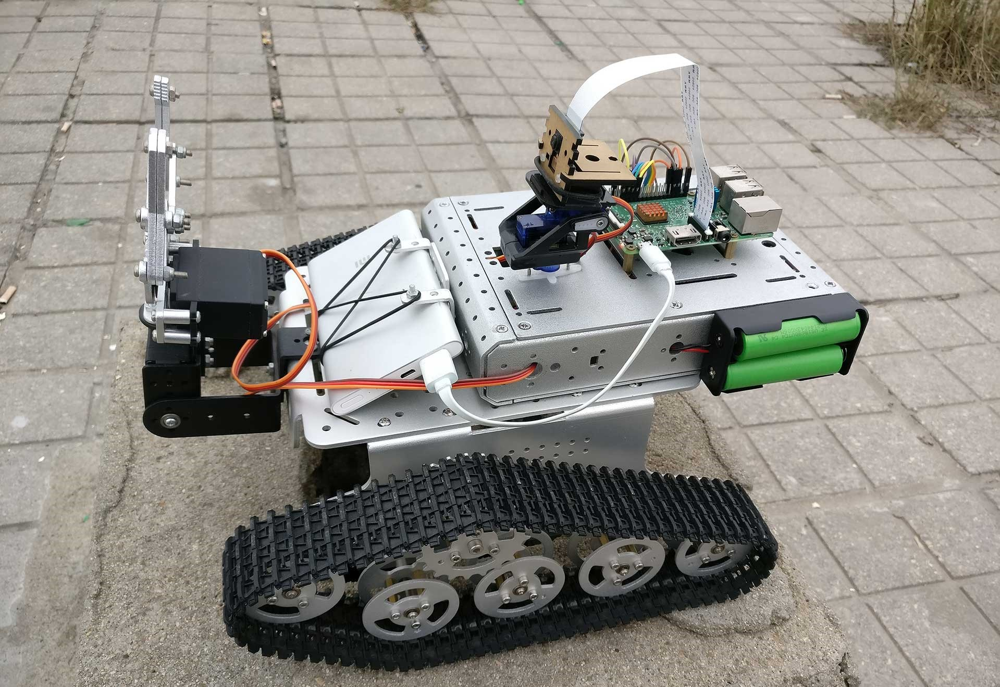

# 写在求职前夕

## APQX

## 2017年6月5日

距离正式毕业还有15天，最终还是到了要离开的日子，离开我生活了四年的郑大校园。平心地说，留恋是很少的，更多的是遗憾，在学习了两年机械工程后，我已无法对无休止的绘图、标注、校核提起任何兴趣，与之相对的是，渐渐神往于由代码构成的计算机世界。这份对未知的好奇也是我坚定转向的动力，也是从那时开始，我发现自己不再像大一那样无法理解C的运作，看似玄而又玄的计算机世界原来是如此的井然有序，如此的合理，计算机按照人的指令辅以精妙的算法和数据结构将世间万物抽象成二进制世界的位运算，再如Java的理念，一切都是对象，而对象可以被创建、引用、销毁，甚至可以被当成垃圾回收。

我学习Java和Android的时间也挺长了，但也只能在繁多的机械课程之余泡图书馆，一边应付机械考试，一边开小差，辛苦自不必说，也还有些收获，作为“副业”的机械学也弄到了四年四次奖学金，以一名之差无缘保研，可以说Very Interesting。真正感觉有提高还是在大四，一来空余时间较多，二来我也跨过了对代码的困惑阶段，《Java编程思想》也不再像第一次读时那样难以理解，对数据结构、网络、数据库的学习也扩大了我的视野，虽然不能像CS专业学生那样关注每一个实现细节，但是其结构和思想绝对有助于我一步步地理解互联网的运作。

以Java为基，我选择了Android作为技术方向，实为兴趣使然。我在大一的时候获得了第一台Android手机Google Nexus 5，从那时开始，我渐渐的发现“Android”和“安卓”是如此的不同，不仅仅体现在GCM上，其操作逻辑、UI设计乃至后台机制似乎都与大陆“隔海相峙”，每年的Google I/O上提到的新特性除了无法更改的系统核心，似乎都与大陆无缘，而这恰恰就是中国的安卓手机生态现状，我自视为初出茅庐的开发者，确实想看到些改变，我也有自己的野望，等待着，或者说参与到“Android”和“安卓”的融合进程中。

我十分清楚，作为非CS专业学生，我唯一的竞争力就是学习能力和对Android的兴趣，目前至少在Android应用层方面，我认为自己有相当的基础，《Android第一行代码》、《Android群英传》、《Android开发艺术探索》、《Effective Java》、《深入理解Java虚拟机》、《Java编程思想》，我花了很长时间来学习这些书籍，尝试从书中窥探软件编程思想。我始终认为基础和兴趣对软件编程来说非常重要，经验则可以用时间交换，从码农到工程师，故步自封是无法完成这个关键性转变的。

在实际项目方面，我做的并不多，大部分都是学习过程中的单项练习，算来综合性的成品共有3个，其实也不足为道。

### 树莓派

去年利用树莓派3B制作的一台履带式机器人，利用WiFi建立树莓派服务端和Android控制端的数据连接，可以远程控制机器人的机械臂动作，摄像头云台的转向，远程拍照并在拍摄完成后立即将照片传回Android手机，可以获取树莓派拍摄的实时视频并显示在手机上，我也写过6篇文章来讲述基本的制作过程。

|  |  |
| :-------------------------------: | :---------------------------------: |

[树莓派遇上Java_01-总述篇](../html/树莓派遇上Java_01-总述篇.html)  
[树莓派遇上Java_02-准备篇](../html/树莓派遇上Java_02-准备篇.html)  
[树莓派遇上Java_03-马达篇](../html/树莓派遇上Java_03-马达篇.html)  
[树莓派遇上Java_04-舵机篇](../html/树莓派遇上Java_04-舵机篇.html)  
[树莓派遇上Java_05-摄像头篇](../html/树莓派遇上Java_05-摄像头篇.html)  
[树莓派遇上Java_06-总结篇](../html/树莓派遇上Java_06-总结篇.html)

这款软件实现了预期的控制功能，只是在编写的时候显然缺乏经验，当时也不懂什么设计模式，程序结构有些杂乱，前段时间闻言Android Things已经支持树莓派3B，有时间的话，想进行一次重构。

### 物流机器人控制器

这个其实是我的毕业设计，很少见的，机械学的毕业设计居然是Android软件。此软件的实现和树莓派的控制器类似，只是在此基础上添加了一个路径规划的功能，即用户在手机上绘制路径，机器人沿着此路径行驶。主要的问题就是那个绘制路径的View，其它也没什么可说的。

### 第三方微博客户端

这个应该是我做的第一个比较完整的软件，由于要从网络加载媒体资源，我第一次遇到了一些之前没有想到的问题，我写了一篇文章来介绍这个软件。

[一次独立APP的尝试](../html/一次独立APP的尝试.html)

如前所述，我确有自知之明，对自己的优势、劣势和当前技术水平有着清醒的认识： 

劣势：非CS出身，没有系统性地学习过计算机基础课，缺乏对很多基础理论的认知。

优势：在Java和Android应用层有扎实的基础，乐于接受新技术，尤其对于一年一次大更新的Android，能保持很高的开发热情，我迟早会补齐短板，包括数据结构、算法、网络等，这只是时间问题。