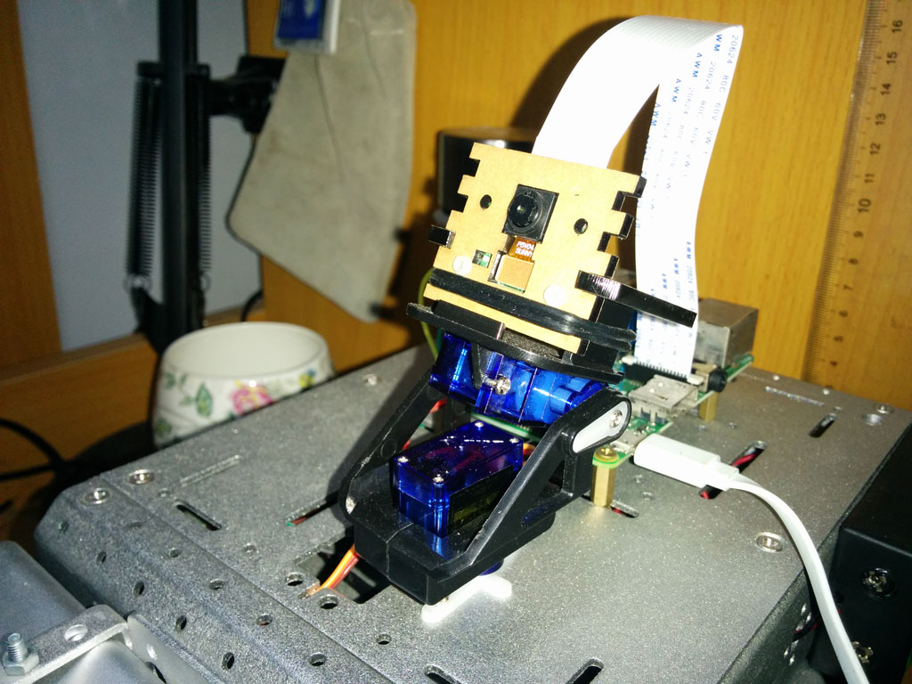

# 树莓派遇上Java_05-摄像头篇

## APQX

## 2016年9月15日

对于我来说，当然希望树莓派驱动的小车可以实时传输画面到控制器，这样才可以远程遥控嘛，一般将摄像头固定在一个两自由度云台上，使之可以自由旋转，拍摄各个方向的画面，具体的操作实现逻辑因人而异，但是基本的摄像头命令都是一样的。树莓派支持两种类型的摄像头，一种是普通USB摄像头（最好是免驱的），一种是树莓派专用的Pi Cam，都可以在淘宝上买到，后者的某些型号还具有红外线夜视功能，价格当然也高一些。这里以树莓派专用的Pi Cam为例，介绍摄像头的基本使用方法。



Pi Cam接在树莓派中部的CSI接口上，不需要额外供电，这里再次强烈建议为树莓派提供独立电源通过USB口供电而不要使用GPIO针脚供电，否则在摄像头开启的瞬间树莓派可能因为电压不稳而重启。

在我的项目中，摄像头通过网络传输视频的原理是，使用MJPG-Streamer调用摄像头拍摄画面并将画面发送到指定的端口上，在浏览器里通过IP地址访问该端口即可显示实时画面。

首先开启摄像头

```
sudo raspi-config
```

简单的拍照指令

```
// 拍照并将照片旋转180度
raspistill -o image.jpg -rot 180
```

安装依赖库

```
sudo apt-get install libjpeg62-dev
sudo apt-get install libjpeg8-dev
```

下载[MJPG-Streamer](https://github.com/jacksonliam/mjpg-streamer)

解压

```
unzip mjpg-streamer-master.zip
```

安装cmake

```
sudo apt-get install cmake
```

切换到mjpg的路径下并编译

```
cd  ~/mjpg-streamer-master/mjpg-streamer-experimental
sudo make clean all
```

将MJPG-Streamer加入环境变量，编辑/etc/profile，在文件底部添加其路径：

```
export LD_LIBRARY_PATH=/opt/mjpg-streamer-master/mjpg-streamer-experimental/
```

开启摄像头，图像旋转180度，分辨率为320x240，30fps，输出到8080端口

```
// 如果是USB摄像头，将input_raspicam.so改为input_uvc.so即可
mjpg_streamer -i "input_raspicam.so  -rot 180 -x 320 -y 240 -fps 30" -o "output_http.so –p 8080 -w /usr/local/www"
```

在浏览器中输入以下地址以接收传输的图像

```
// 静态图片
http://树莓派IP:8080/?action=snapshot
// 动态图像
http://树莓派IP:8080/?action=stream
// 动态图像
http://树莓派IP:8080/javascript_simple.html
```

以上就是树莓派摄像头的基本操作方法，对于Android控制端，一般通过WebView来接受图像，我们可以监听WebView的触控事件，当手指在WebView上滑动的时候，控制摄像头云台转动让摄像头根据手指的滑动来拍摄指定角度的画面，是一个不错的体验。

那么当摄像头正在工作的情况下如何远程关掉摄像头呢？比如正在传输视频，现在需要调用摄像头拍照，那么必须先使摄像头停止工作才能调用它做另外的事，这里可以远程命令Linux杀掉开启摄像头的进程。一般通过进程名来杀掉进程，因为进程名不会像PID那样变化，分为两步： 

获取进程名

```
ps -eo pid,comm,cmd
```

杀掉指定的进程
```
killall 进程名
```

对于摄像头传输视频的质量，可以根据自己的网络状况自定义，配合相应的FPS，使画面流畅显示。有时会出现断流的情况，刷新浏览器即可。